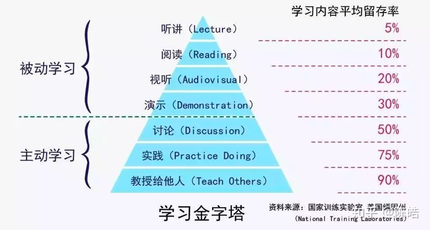

- [初衷](#初衷)
- [规则](#规则)
  - [A - Algorithm](#a---algorithm)
  - [R - Review](#r---review)
  - [T - Tip](#t---tip)
  - [S - Share](#s---share)
  - [其他](#其他)
- [参考](#参考)

# 初衷
* 从源头获取第一手知识。
* 主动学习，主动思考。
* 知识多样化。
* 学习有计划。

# 规则
## A - Algorithm
* 说明：即算法，可以解决一道新的算法题目，也可以为旧的题目找到更优的解决方案。
* 目的：编程练习，算法学习。

## R - Review
* 说明：即文章，阅读并点评一篇优秀的英文文章，可以是技术文也可以是休闲文、科普文。
* 目的：提高英文水平。

## T - Tip
* 说明：即技巧，学习或记录一个技术技巧、知识点滴。
* 目的：总结归纳知识，长期来看以点带面。

## S - Share
* 说明：即分享，分享一篇有观点、有思考的文章，不拘文章类型。
* 目的：主动思考，建立影响力，输出价值观。

## 其他
* 以周维度产出 ARTS 成果。
* 技巧点可以扩展成知识面，需要另开目录输出系列内容。
* 每周 ARTS 题目格式：`${周一日期}-${年第几周}`，示例“2020-10-12（第 42 周）”。

# 参考
* [极客时间《左耳听风》发起的ARTS挑战怎么参加？](https://www.zhihu.com/question/301150832)